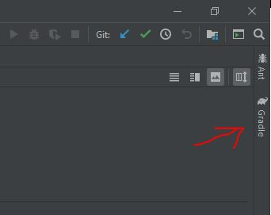
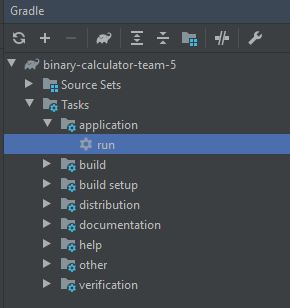

This project builds in IntelliJ along with gradle. 
-  Clone the Repository in IntelliJ
-  Import the gradle project with the message provided.

- Click on the Gradle tab on the far right

-  Click through the structure pictured, and double-click run!

## Task Distribution

Christopher Staszewski-

Colin Thomas- Made the graphical calculator with javafx. Set up repository and intellij/gradle project. Wrote directions in README

Jacob Goelz- Made the initial multiplication class for the assignment. Updated the ReadMe so the other members can add what they did.

Julian-

Parker Carlson-
